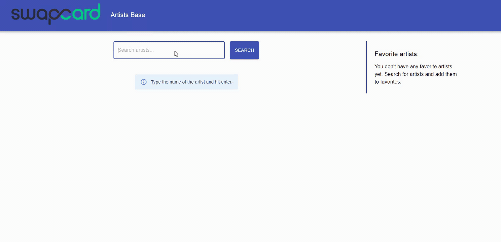

# Project Title

Artists browser implemented with GraphQL API endpoint

## Demo

The app is deployed via Netlify (https://www.netlify.com/) and can be accessed here: https://upbeat-murdock-a8fc1e.netlify.app/




## Getting Started

These instructions will get you a copy of the project up and running on your local machine for development and testing purposes. See deployment for notes on how to deploy the project on a live system.

### Clone

Clone this repo to your local machine using https://github.com/celinawierzbicka/swapcard.git

### Setup

Install all npm packages

```
$ npm install
```

## How To Run

```
$ npm run start
```
Runs the app in the development mode.<br />
Open [http://localhost:3000](http://localhost:3000) to view it in the browser.

The page will reload if you make edits.<br />

```
$ npm run build
```

Builds the app for production to the `build` folder.<br />
It correctly bundles React in production mode and optimizes the build for the best performance.

The build is minified and the filenames include the hashes.<br />
The app is ready to be deployed!

## Built With

This project was bootstrapped with [Create React App](https://github.com/facebook/create-react-app).

Used Libraries:
* [Redux](https://redux.js.org/) - State Management Library (implemented with react hooks)
* [Material UI](https://material-ui.com/) - Library with Pre-Designed Components for React
* [Apollo Boost](https://www.npmjs.com/package/apollo-boost) - package to set up Apollo Client
* [GraphQL](https://www.npmjs.com/package/graphql) - The JavaScript reference implementation for GraphQL, a query language for APIs created by Facebook.


## Authors

* **Celina Wierzbicka** (https://github.com/celinawierzbicka)